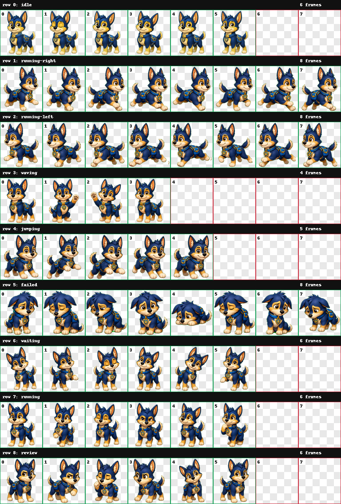

# Codex Pets - Ranger

[English](README.md)

这个仓库包含 **Ranger**，一只原创的蓝金配色救援小狗 Codex 宠物。

## 预览



| 待命 | 打招呼 | 等待输入 |
| --- | --- | --- |
|  |  |  |

| 向右移动 | 向左移动 | 复核 |
| --- | --- | --- |
|  |  |  |

## 安装

把 `pets/ranger` 文件夹复制到你的 Codex 宠物目录：

```powershell
Copy-Item -Recurse -Force .\pets\ranger $env:USERPROFILE\.codex\pets\ranger
```

然后重启 Codex，或者重新加载宠物选择器，并选择 `Ranger`。

## 文件

- `pets/ranger/pet.json` - Codex 宠物清单
- `pets/ranger/spritesheet.png` - 已验证的 9 状态 sprite atlas
- `qa/ranger/contact-sheet.png` - 视觉检查总览图
- `qa/ranger/previews/*.gif` - 各状态动画预览
- `qa/ranger/validation.json` - atlas 校验结果

## 状态

- `idle` - 空闲待命
- `running-right` - 向右拖动/移动
- `running-left` - 向左拖动/移动
- `waving` - 打招呼
- `jumping` - 跳跃响应
- `failed` - 失败或受阻
- `waiting` - 等待输入或确认
- `running` - 正在处理任务
- `review` - 复核输出
